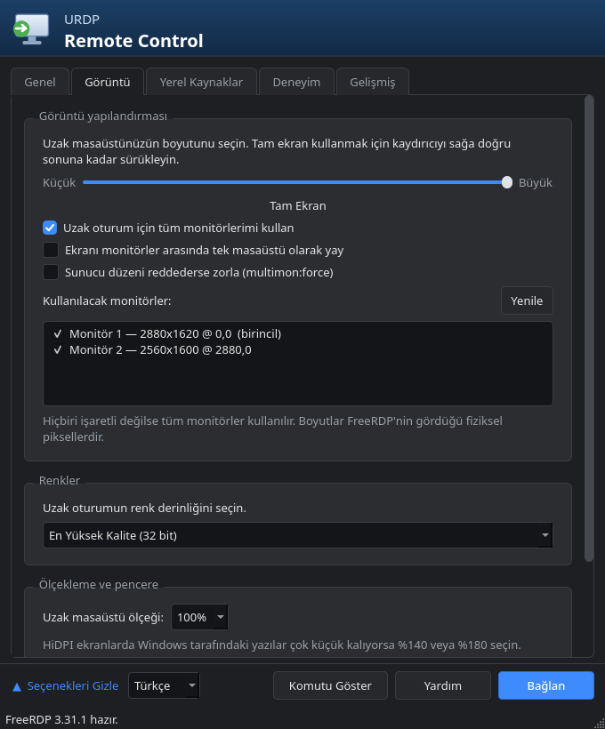

# URDP Remote Control

A Linux front-end for Windows Remote Desktop, laid out like `mstsc.exe` — the
same five tabs, the same options, a dark theme. FreeRDP does the actual work.

The reason it exists is **multi-monitor**: mstsc's "Use all my monitors for the
remote session" is here too, and you can pick which monitors to hand over.
Windows genuinely sees two monitors — taskbar on both, maximize fills one
screen, `Win+Shift+Arrow` moves a window across.

🇹🇷 [Türkçe README](README.tr.md)

## Screenshots

| General | Display |
|---|---|
|  |  |

| Local Resources | Experience | Advanced |
|---|---|---|
|  |  |  |


## Requirements

This program does not speak RDP itself — **it is a front-end that runs
FreeRDP.** Without FreeRDP it can do nothing, so that is the first requirement.

| Package | Why | Required |
|---|---|---|
| **FreeRDP 3** (`xfreerdp3`) | Makes the actual connection | **Yes** |
| **PyQt6** | The interface | **Yes** |
| `libsecret` (`secret-tool`) | Stores passwords in KDE Wallet / GNOME Keyring | No, but password saving needs it |

FreeRDP **3** is required. FreeRDP 2 spells many options differently
(`/cert-tofu`, `/monitor-list`); if an older version is found, the application
says so in the status bar.

```bash
# Arch / CachyOS / Manjaro
sudo pacman -S freerdp python-pyqt6 libsecret

# Debian 13+ / Ubuntu 24.04+
sudo apt install freerdp3-x11 python3-pyqt6 libsecret-tools

# Fedora
sudo dnf install freerdp python3-pyqt6 libsecret

# openSUSE
sudo zypper install freerdp3 python313-PyQt6 libsecret-tools
```

Check it landed:

```bash
xfreerdp3 /version
```

It must print `3.x`. If it does not, your distribution has no FreeRDP 3 package
— that is the case on older Debian/Ubuntu releases. The Flatpak build
(`flatpak install flathub com.freerdp.FreeRDP`) works, but then you need a
wrapper named `xfreerdp3` somewhere on your `PATH`.

## Install

From inside the repository:

```bash
./install.sh
```

That creates a `~/.local/bin/urdp` symlink and an application-menu entry. No
root, nothing written outside `$HOME`. To uninstall, delete those two files.

To try it without installing:

```bash
./bin/urdp
```

## Use

1. On the **General** tab, enter the computer name and user name.
2. On the **Display** tab, tick "Use all my monitors for the remote session".
3. **Connect**.

`Ctrl+Alt+Enter` leaves full screen.

### Languages

English, Turkish, German, Spanish, French and Russian. The picker sits in the
bottom-left corner; the choice is remembered. On first run the language is
taken from your environment (`LANG`).



Adding one is a single file — copy `urdp/locale/en.json`'s key set from
`keys.json`, translate the values, save it as `urdp/locale/<code>.json`. No code
changes, no build step. `python3 -m unittest discover -s tests` then checks that
your file matches the strings in the source and that every `{placeholder}`
survived.

### The tabs

| Tab | Contents |
|---|---|
| **General** | Address, port, user, domain, password, profile save/open |
| **Display** | Resolution slider, multi-monitor, monitor picker, colour depth, 100/140/180% scaling, connection bar |
| **Local Resources** | Audio direction and backend, microphone, keyboard hook and layout, printers, clipboard, smart cards, serial/parallel ports, USB, folder redirection |
| **Experience** | Connection-speed preset and its six visual effects, graphics pipeline (AVC444/AVC420/RFX), caching, compression, auto-reconnect |
| **Advanced** | Certificate policy, security layer (NLA/TLS/RDP), RD Gateway, admin/restricted-admin session, RemoteApp, timeout, extra FreeRDP options |

### Compared with mstsc

Every option from mstsc's five tabs has a counterpart. On top of that:

- Pick individual monitors (`/monitors:`)
- Choose the FreeRDP graphics codec, and see which codecs the installed FreeRDP
  build actually supports
- HiDPI scaling
- As many redirected folders as you like
- **Show Command** prints the generated `xfreerdp3` command line, ready to paste
  into a script
- **Test** resolves the address and probes port 3389 before you connect

The one thing with no counterpart is mstsc's "Use a web account to sign in to
the remote computer"; FreeRDP's Entra ID flow works differently.

## Codecs — is there H.265?

No. The RDP protocol defines no H.265/HEVC codec; the ceiling is H.264
(AVC444). Full evidence, and where the "but my system uses H.265" impression
comes from: [docs/codecs.md](docs/codecs.md).

At startup the application reads `xfreerdp3 /buildconfig` and shows, on the
Experience tab, which codecs the installed FreeRDP really supports; codecs that
were not compiled in are greyed out. This matters, because FreeRDP's `/gfx`
parser **silently ignores** values it does not recognise — a wrong codec name
does nothing at all, without an error.

## Profiles and files

- Profiles: `~/.config/urdp/profiles.json`
- Passwords: libsecret (KDE Wallet / GNOME Keyring). They are **never** written
  to the configuration file and never passed on the command line — `/from-stdin`
  feeds them through the process' standard input, so they do not show up in
  `ps`. The credential prompt's "Remember me" box can start saving one;
  clearing it deletes the stored password.
- **Save As** writes a real `.rdp` file that `mstsc.exe` can open on Windows,
  and **Open** reads the `.rdp` files mstsc writes.

## When a connection fails

FreeRDP reports a single error for every unreachable host:
`ERRCONNECT_CONNECT_FAILED`. A wrong name, a sleeping machine and a broken VPN
route all produce that same line. The application then probes the host itself
and says which one it is:

- the name does not resolve,
- the address answers but the port is closed (Remote Desktop is off),
- or nothing answers at all (machine asleep, firewall, or the route to that
  address is broken).

The **Test** button on the General tab runs the same probe before you connect.

## Known limits

- The Windows side must be a **Pro / Enterprise / Education** edition. Home has
  no RDP server.
- The certificate question cannot be shown, because the application has no
  terminal; the policy is chosen in advance on the **Advanced** tab. "Warn me"
  stores the certificate on first connect (TOFU) and refuses the connection if
  it later changes.
- Dynamic resolution and smart sizing only work for a single monitor in
  windowed mode; RDP does not support them with multiple monitors.
- On Wayland, FreeRDP's X11 client is used through XWayland. The native Wayland
  client `wlfreerdp3` is avoided because its multi-monitor support is not
  reliable.

## Development

```bash
QT_QPA_PLATFORM=offscreen python3 -m unittest discover -s tests -v
```

The tests cover the non-GUI core: command generation, `.rdp` conversion,
profile parsing, monitor-list parsing, the reachability probe, and translation
integrity.

| File | Responsibility |
|---|---|
| `profile.py` | Settings model, connection-speed presets |
| `rdpcmd.py` | `Profile` → `xfreerdp3` command line, validation |
| `rdpfile.py` | Read/write `.rdp` |
| `store.py` | `profiles.json` |
| `keyring.py` | `secret-tool` wrapper |
| `monitors.py` | Parses `xfreerdp3 /list:monitor` |
| `capabilities.py` | Codec detection via `xfreerdp3 /buildconfig` |
| `probe.py` | Name resolution + TCP probe for failure diagnosis |
| `session.py` | Process supervision and error diagnosis |
| `i18n.py`, `locale/` | Translation |
| `theme.py`, `widgets.py` | Dark theme and shared pieces |
| `tab_*.py` | The five tabs |
| `mainwindow.py` | Window, profile management, connect flow |

## Licence

MIT.
