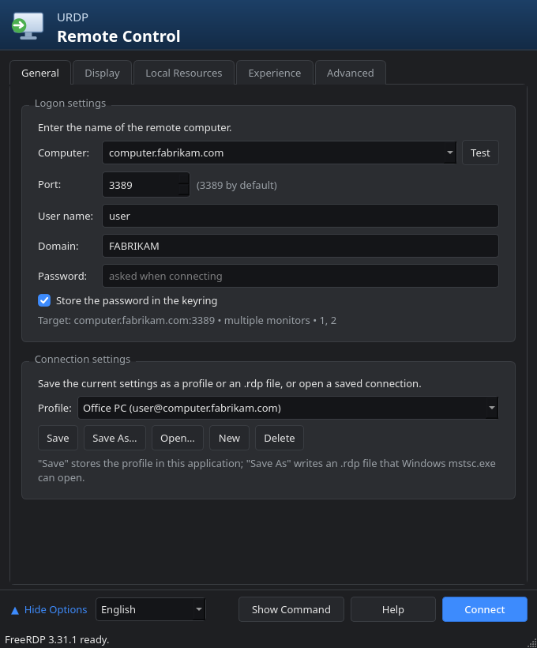
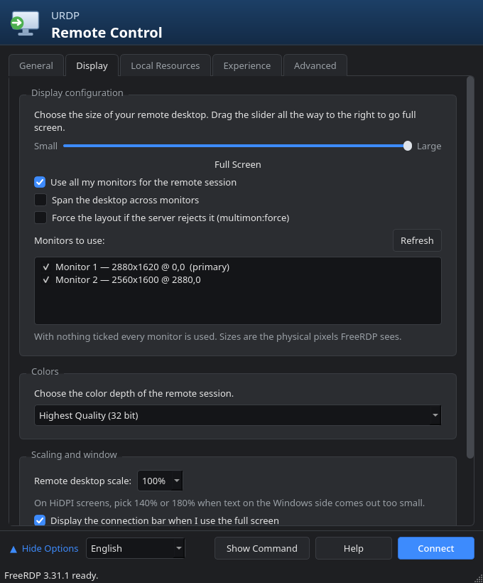
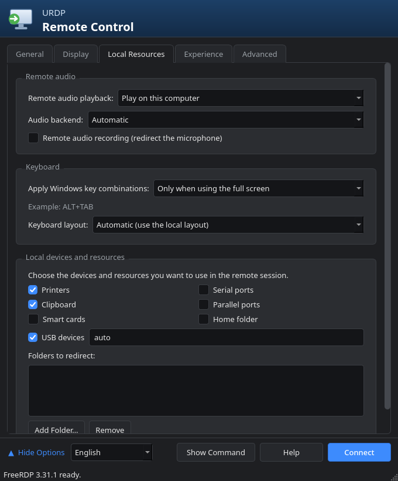
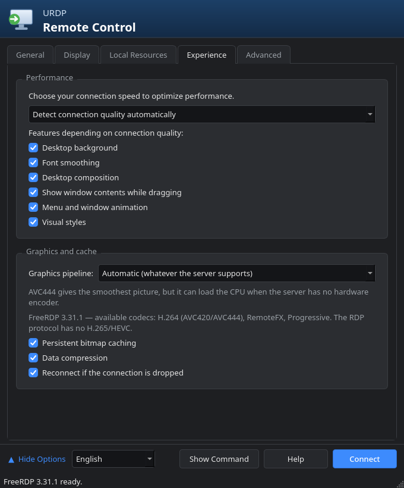
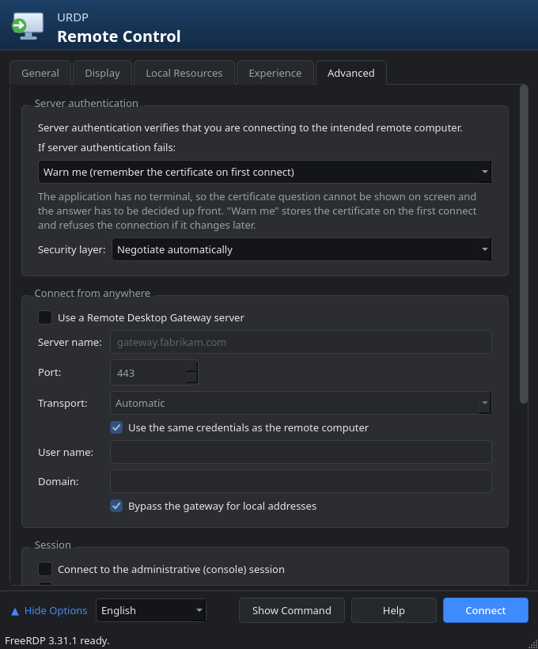
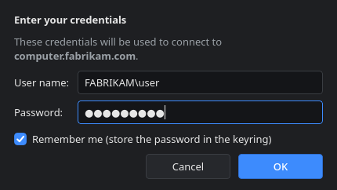

# URDP Remote Control

🇬🇧 [English README](README.md)

Windows'un `mstsc.exe` (Uzak Masaüstü Bağlantısı) penceresinin Linux karşılığı.
Aynı beş sekme, aynı seçenekler, karanlık tema — arka planda FreeRDP çalışır.

Öne çıkan yanı **çift/çoklu monitör**: mstsc'deki "Uzak oturum için tüm
monitörlerimi kullan" seçeneği burada da var, üstelik hangi monitörlerin
kullanılacağını tek tek seçebiliyorsunuz.

## Ekran görüntüleri

| Genel | Görüntü |
|---|---|
|  |  |

| Yerel Kaynaklar | Deneyim | Gelişmiş |
|---|---|---|
|  |  |  |



## Gereksinimler

Bu uygulama kendi başına RDP konuşmaz — **arka planda FreeRDP'yi çalıştıran bir
arayüzdür.** FreeRDP kurulu değilse hiçbir şey yapamaz, o yüzden ilk şart odur.

| Paket | Neden gerekli | Zorunlu mu |
|---|---|---|
| **FreeRDP 3** (`xfreerdp3`) | Bağlantıyı asıl kuran program | **Evet** |
| **PyQt6** | Arayüz | **Evet** |
| `libsecret` (`secret-tool`) | Parolayı KDE Cüzdan / GNOME Keyring'de saklamak | Hayır, ama parola kaydetme onsuz çalışmaz |

FreeRDP **3** gerekiyor. FreeRDP 2 birçok seçeneği farklı yazar
(`/cert-tofu`, `/monitor-list` gibi); uygulama eski bir sürüm bulursa durum
çubuğunda uyarır.

```bash
# Arch / CachyOS / Manjaro
sudo pacman -S freerdp python-pyqt6 libsecret

# Debian 13+ / Ubuntu 24.04+
sudo apt install freerdp3-x11 python3-pyqt6 libsecret-tools

# Fedora
sudo dnf install freerdp python3-pyqt6 libsecret

# openSUSE
sudo zypper install freerdp3 python313-PyQt6 libsecret-tools
```

Doğru kurulduğunu şöyle sınayabilirsiniz:

```bash
xfreerdp3 /version
```

`3.x` yazmalı. Yazmıyorsa dağıtımınızın deposunda FreeRDP 3 yok demektir;
Debian/Ubuntu'nun eski sürümlerinde durum budur, Flatpak sürümü
(`flatpak install flathub com.freerdp.FreeRDP`) iş görür ama o zaman
başlatıcının `xfreerdp3`'ü bulabilmesi için PATH'e bir sarmalayıcı koymanız
gerekir.

## Kurulum

Depo içinden:

```bash
./install.sh
```

`~/.local/bin/urdp` sembolik bağını ve uygulama menüsü kısayolunu oluşturur.
Root gerekmez, `$HOME` dışına hiçbir şey yazmaz. Kaldırmak için iki dosyayı
silmeniz yeterli.

Kurmadan denemek isterseniz:

```bash
./bin/urdp
```

## Kullanım

1. **Genel** sekmesinde bilgisayar adını ve kullanıcı adını girin.
2. **Görüntü** sekmesinde "Uzak oturum için tüm monitörlerimi kullan"ı işaretleyin.
3. **Bağlan**.

Tam ekrandan çıkmak için `Ctrl+Alt+Enter`.

### Diller

37 dil — Windows'un kendi sunduğu görüntü dili setiyle aynı:

`en` English · `da` Dansk · `de` Deutsch · `et` Eesti · `es` Español · `fr` Français · `hr` Hrvatski · `id` Indonesia · `it` Italiano · `lv` Latviešu · `lt` Lietuvių · `hu` Magyar · `nl` Nederlands · `nb` Norsk bokmål · `pl` Polski · `pt` Português · `pt_BR` Português (Brasil) · `ro` Română · `sk` Slovenčina · `sl` Slovenščina · `sr` Srpski · `fi` Suomi · `sv` Svenska · `vi` Tiếng Việt · `tr` Türkçe · `cs` Čeština · `el` Ελληνικά · `bg` Български · `ru` Русский · `uk` Українська · `he` עברית · `ar` العربية · `th` ไทย · `ja` 日本語 · `zh_CN` 简体中文 · `zh_TW` 繁體中文 · `ko` 한국어

Seçici sol alt köşede; seçim hatırlanıyor. İlk açılışta dil ortamdan (`LANG`)
alınır; bölge kodu olan bir yerel ayar (`pt_BR`, `zh_CN`) varsa yalın dilin
önüne geçer. Arapça ve İbranice'de yalnızca metin değil, arayüzün tamamı
aynalanır.

> **Çeviriler makine üretimidir ve ana dili konuşanlarca gözden geçirilmemiştir.**
> Düzeltmeler memnuniyetle karşılanır — issue ya da pull request açın. Yanlış bir
> kelime, tek bir JSON dosyasındaki tek satırdır.

Yeni dil eklemek tek dosya: `keys.json` içindeki anahtar kümesini alın,
değerleri çevirin, `urdp/locale/<kod>.json` olarak kaydedin. Kod değişikliği ya
da derleme adımı yok. Testler dosyanızın kaynaktaki dizgelerle örtüştüğünü ve
`{yer_tutucu}` ifadelerinin korunduğunu doğrular.

### Sekmeler

| Sekme | İçerik |
|---|---|
| **Genel** | Adres, port, kullanıcı, etki alanı, parola, profil kaydetme/açma |
| **Kimlik penceresi** | Kayıtlı parola yoksa bağlanırken açılır: kullanıcı adı, parola ve Windows'taki gibi "Beni hatırla" kutusu |
| **Görüntü** | Çözünürlük kaydırıcısı, çoklu monitör, monitör seçimi, renk derinliği, %100/140/180 ölçekleme, bağlantı çubuğu |
| **Yerel Kaynaklar** | Ses yönü ve arka ucu, mikrofon, klavye kancası ve düzeni, yazıcı, pano, akıllı kart, seri/paralel port, USB, klasör yönlendirme |
| **Deneyim** | Bağlantı hızı ön ayarı ve altı görsel efekt, grafik hattı (AVC444/AVC420/RFX), önbellek, sıkıştırma, otomatik yeniden bağlanma |
| **Gelişmiş** | Sertifika politikası, güvenlik katmanı (NLA/TLS/RDP), RD Gateway, yönetici/kısıtlı yönetici oturumu, RemoteApp, zaman aşımı, ek FreeRDP parametreleri |

### mstsc ile karşılaştırma

Beş sekmedeki her mstsc seçeneğinin karşılığı vardır. Ek olarak:

- Kullanılacak monitörleri tek tek seçme (`/monitors:`)
- FreeRDP grafik hattı (codec) seçimi ve kurulu FreeRDP yapısının gerçekten
  hangi kodekleri desteklediğinin gösterilmesi
- HiDPI ölçekleme
- Klasör yönlendirmede istediğiniz kadar paylaşım
- "Komutu Göster" ile üretilen `xfreerdp3` komutunu görüp betiğe kopyalama
- **Sına** düğmesi: bağlanmadan önce adı çözer ve 3389 portunu yoklar

Karşılığı olmayan tek şey mstsc'nin "Uzak bilgisayarda oturum açmak için bir web
hesabı kullan" seçeneğidir; FreeRDP'nin Azure AD/Entra akışı farklı çalışır.

## Kodekler — H.265 var mı?

Yok. RDP protokolünde H.265/HEVC diye bir kodek tanımlı değil; tavan H.264
(AVC444). Ayrıntılı kanıt ve "ama benim sistemim H.265 kullanıyor" izleniminin
nereden geldiği: [docs/codecs-tr.md](docs/codecs-tr.md).

Uygulama açılışta `xfreerdp3 /buildconfig` çıktısını okur ve Deneyim sekmesinde
kurulu FreeRDP'nin gerçekten hangi kodekleri desteklediğini yazar; derlenmemiş
olanları seçilemez yapar. Bu önemli, çünkü FreeRDP'nin `/gfx` ayrıştırıcısı
tanımadığı değerleri **sessizce yok sayıyor** — yanlış bir kodek adı hata
vermeden hiçbir şey yapmaz.

## Profiller ve dosyalar

- Profiller: `~/.config/urdp/profiles.json`
- Parolalar: libsecret (KDE Cüzdan / GNOME Keyring) — yapılandırma dosyasına
  **yazılmaz**, komut satırına da geçirilmez. Kimlik penceresindeki "Beni
  hatırla" kutusu işaretlenirse parola oradan da kaydedilebilir; kutu
  kaldırılırsa kayıtlı parola anahtarlıktan silinir. `/from-stdin` ile sürecin standart
  girdisinden verilir, böylece `ps` çıktısında görünmez.
- **Farklı Kaydet** gerçek bir `.rdp` dosyası üretir; Windows'ta `mstsc.exe` ile
  açılabilir. **Aç** ise mstsc'nin yazdığı `.rdp` dosyalarını okur.

## Bağlantı kurulamazsa

FreeRDP ulaşılamayan her durum için tek bir hata verir:
`ERRCONNECT_CONNECT_FAILED`. Yanlış ad da, uyuyan makine de, kırık bir VPN
rotası da aynı satırı yazar. Uygulama bu durumda kendiliğinden bir yoklama
yapar ve hangisi olduğunu söyler:

- ad hiç çözümlenmiyor mu,
- adres yanıt verip portu mu kapalı (Uzak Masaüstü kapalı),
- yoksa hiç yanıt mı yok (makine uykuda, güvenlik duvarı, ya da o adrese giden
  yol çalışmıyor).

Aynı yoklamayı Genel sekmesindeki **Sına** düğmesiyle bağlanmadan önce de
çalıştırabilirsiniz.

## Bilinen sınırlar

- Windows tarafı **Pro / Enterprise / Education** olmalıdır. Home sürümünde RDP
  sunucusu yoktur.
- Sertifika sorusu bir uçbirim olmadığı için ekranda gösterilemez; **Gelişmiş**
  sekmesindeki politika önceden belirlenir. "Beni uyar" sertifikayı ilk
  bağlantıda kaydeder (TOFU) ve sonradan değişirse bağlantıyı reddeder.
- Dinamik çözünürlük ve pencereye sığdırma yalnızca tek monitörlü pencere
  modunda çalışır; çoklu monitörde RDP bunu desteklemez.
- Wayland'de FreeRDP'nin X11 istemcisi (XWayland üzerinden) kullanılır. Native
  Wayland istemcisi `wlfreerdp3` çoklu monitörü düzgün desteklemediği için
  tercih edilmez.

## Geliştirme

```bash
python3 -m unittest discover -s tests -v
```

Testler yalnızca GUI dışı çekirdeği kapsar: komut üretimi, `.rdp` dosya
dönüşümü, profil ayrıştırma, monitör listesi çözümleme.

Kod düzeni:

| Dosya | Sorumluluk |
|---|---|
| `profile.py` | Ayar modeli, bağlantı hızı ön ayarları |
| `rdpcmd.py` | `Profile` → `xfreerdp3` komut satırı |
| `rdpfile.py` | `.rdp` oku/yaz |
| `store.py` | `profiles.json` |
| `keyring.py` | `secret-tool` sarmalayıcı |
| `monitors.py` | `xfreerdp3 /list:monitor` çözümleme |
| `capabilities.py` | `xfreerdp3 /buildconfig` ile kodek yeteneği tespiti |
| `probe.py` | Ad çözümleme + TCP yoklaması ile bağlantı hatası teşhisi |
| `session.py` | Süreç yönetimi ve hata teşhisi |
| `theme.py` / `widgets.py` | Karanlık tema ve ortak parçalar |
| `tab_*.py` | Beş sekme |
| `mainwindow.py` | Pencere, profil yönetimi, bağlanma akışı |

## Lisans

MIT — `LICENSE` dosyasındaki telif sahibi adını kendinizle değiştirin.
